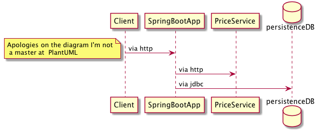
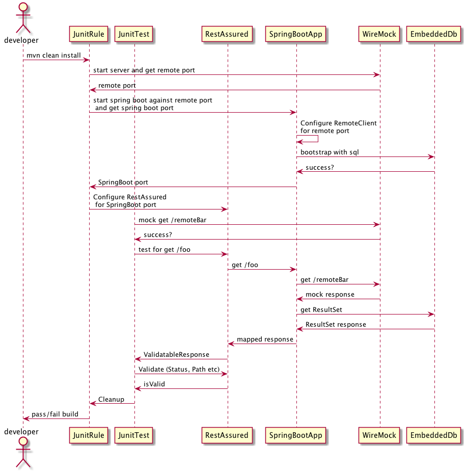

# Testing with Spring Boot

### Purpose
This article will walk through a quick overview of what Spring Boot is, the latest testing facilities that Spring Boot provides, examples if you don't use those facilities that are equivalent and  and a contrived example that uses the constituent parts of these facilities in order to complete an end to end test client to mocked back end services.

1. [What is Spring Boot](#what-is-spring-boot)
2. [New Spring Boot Test Annotations](#new-spring-boot-test-annotations)
3. [Example Service Using These Facilities (sort of)](#my-example-service)

### What is Spring Boot
1. **Opinionated**: Spring Boot is opinionated in that if you just want the defaults it’s great. Spring Boot will autoconfigure everything for you and you’re all set. If you want to pick and choose things it’s still possible but you may have to pierce the veil quite a bit to facilitate that. This is very similar to the XML style namespace config that Spring supports, the same thing happens there, if you can do defaults your great, otherwise you’ll need to understand the auto configuration a lot more, and usually the underlying implementation much more.
2. **Auto Configuration via Classpath Scanning**: Spring Boot will start bootstrapping configuration for things if it recognizes it on the classpath. What this means is you should only bring the jars that actually matter to your application. This will break down, for instance, if someone declares Mockito as a runtime dependency and it has Jetty so Spring Boot will bootstrap Spring MVC configuration for Jetty just because it’s there. This can be turned off, but of course you are losing the win of Spring Boot
3. **Documentation and Appendices**: Because a lot of things are auto configured and exposed to your application you will need to know what they are, and often common properties that can be used to do some minimal configuration.  The appendices have all that documented and it’s really a must for any production grade configuration IMO.
4. **Conventions**: Failing using the documentation you can also “Go fish” quite a bit inside the IDE, the naming conventions are pretty guessable and the names are usually very good.  @Enable* is the annotation equivalent of XML style namespace configuration that you can use by hand as opposed to classpath scanning, this really isn’t a Spring Boot-ism as it predates that.  @AutoConfigure* are the test specific to bootstrap testing without using full blown autoconfiguration, basically the most important thing to handle the “slice” of beans started for testing.  *AutoConfiguration classes are the @Configuration “magic” that configures basically everything in Spring Boot, e.g. @EnableJpaRepositories == (under spring boot auto configuration or import) JpaRepositoriesAutoConfiguration.  *Customizer beans, a callback for a given common thing, think Jackson ObjectMapper, Spring RestTemplate that are created as part of standard bootstrapping of Spring Boot that you don’t need to create on your own, e.g. Jackson2ObjectMapperBuilderCustomizer.

### New Spring Boot Test Annotations
Typically these are just composite annotations around a bunch of @AutoConfigure* and coupled with a TypeExcludeFilter in order to limit beans created for a test.  They all use @ImportAutoConfiguration which is the test version of @EnableAutoConfiguration that would be used in a runtime application as opposed to a test.   @ImportAutoConfiguration applies the @AutoConfigure* classes in the same way as @EnableAutoConfiguration would.

1. [@DataJpaTest](#datajpatest)
2. [@RestClientTest](#restclienttest)
3. [@JsonTest](#jsontest)

#### @DataJpaTest
This annotation is the aggregate of {@Transactional @AutoConfigureCache @AutoConfigureDataJpa @AutoConfigureTestDatabase @AutoConfigureTestEntityManager}

1. **AutoConfigureTestDatabase**: This annotation will automatically create an in memory database and will use a DDL script if you configure the application on where to find that or if you follow the convention you can put them at classpath:/schema-{platform}.sql
2. **AutoConfigureTestEntityManager**: This annotation will automatically create a TestEntityManager for use in your tests, has convenience methods for your Tests and allows you too not have to expose non production methods that are used just in testing.

This is from [Spring Boot Test Samples](https://github.com/spring-projects/spring-boot/blob/master/spring-boot-samples/spring-boot-sample-test/src/test/java/sample/test/domain/UserRepositoryTests.java)

```java
@RunWith(SpringRunner.class)
@DataJpaTest
public class UserRepositoryTests {

	private static final VehicleIdentificationNumber VIN = new VehicleIdentificationNumber(
			"00000000000000000");

	@Autowired
	private TestEntityManager entityManager;

	@Autowired
	private UserRepository repository;

	@Test
	public void findByUsernameShouldReturnUser() throws Exception {
		this.entityManager.persist(new User("sboot", VIN));
		User user = this.repository.findByUsername("sboot");
		assertThat(user.getUsername()).isEqualTo("sboot");
		assertThat(user.getVin()).isEqualTo(VIN);
	}

	@Test
	public void findByUsernameWhenNoUserShouldReturnNull() throws Exception {
		this.entityManager.persist(new User("sboot", VIN));
		User user = this.repository.findByUsername("mmouse");
		assertThat(user).isNull();
	}

}
```

If you use a multimodule project the win of bootstrapping bean slicing is lost because the Spring Boot Test annotations require the @SpringBootApplication be available, however, that's not a big loss it just requires you to understand how to configure the slice of tests for a given module.  This is from an example project that I will be showing in the end.  This uses intentionally verbose configuration as I tend to like to be explicit in my projects.

```java
@Configuration
@EnableJpaRepositories(basePackages = {"com.github.pfrank13.presentation.boot.repository"},
                       entityManagerFactoryRef = "persistenceDbEntityManagerFactory",
                       transactionManagerRef = "persistenceDbTransactionManager")
@EnableTransactionManagement
public class RepositoryConfig {
  private DataSource persistenceDbDataSource;
  private String hibernateDialect;

  @Autowired
  public RepositoryConfig(final DataSource persistenceDbDataSource,
                          @Value("${persistence.hibernate.dialect}") final String hibernateDialect){
    this.persistenceDbDataSource = persistenceDbDataSource;
    this.hibernateDialect = hibernateDialect;
  }

  @Bean
  public EntityManagerFactory persistenceDbEntityManagerFactory(){
    final LocalContainerEntityManagerFactoryBean factoryBean =
        new LocalContainerEntityManagerFactoryBean();
    factoryBean.setDataSource(persistenceDbDataSource);
    factoryBean.setPersistenceUnitName("persistenceDb");
    factoryBean.setPackagesToScan("com.github.pfrank13.presentation.boot.model");
    final HibernateJpaVendorAdapter jpaVendorAdapter = new HibernateJpaVendorAdapter();
    jpaVendorAdapter.setGenerateDdl(false);
    jpaVendorAdapter.setShowSql(true);

    jpaVendorAdapter.setDatabasePlatform(hibernateDialect);
    factoryBean.setJpaVendorAdapter(jpaVendorAdapter);

    factoryBean.afterPropertiesSet();

    return factoryBean.getObject();
  }

  @Bean
  public PlatformTransactionManager persistenceDbTransactionManager() {
    final JpaTransactionManager jpaTransactionManager = new JpaTransactionManager();
    jpaTransactionManager.setEntityManagerFactory(this.persistenceDbEntityManagerFactory());

    return jpaTransactionManager;
  }
}

@Configuration
public class PersistenceDbClientConfig {
  private final CategoryRepository categoryRepository;
  private final ItemRepository itemRepository;

  @Autowired
  public PersistenceDbClientConfig(
      final CategoryRepository categoryRepository,
      final ItemRepository itemRepository) {
    this.categoryRepository = categoryRepository;
    this.itemRepository = itemRepository;
    afterPropertiesSet();
  }

  private void afterPropertiesSet(){
    Assert.notNull(categoryRepository, "CategoryRepository cannot be null.");
    Assert.notNull(itemRepository, "ItemRepository cannot be null.");
  }

  @Bean
  public PersistenceDbClient persistenceDbClient(){
    return new PersistenceDbClientImpl(categoryRepository, itemRepository);
  }
}

@Configuration
@RunWith(SpringRunner.class)
@ContextConfiguration(classes = {PersistenceDbClientTest.class})
@ComponentScan(basePackages = {"com.github.pfrank13.presentation.boot.conf"})
@Transactional
public class PersistenceDbClientTest {
  @PersistenceContext(name = "persistenceDb")
  private EntityManager entityManager;
  @Autowired
  private PersistenceDbClient persistenceDbClient;

  @Test
  public void loadCategoryById() {
    //GIVEN
    final Category category = new Category();
    category.setName("category");
    AbstractEntity.setDates(category);

    entityManager.persist(category);

    //WHEN
    final Optional<Category> found = persistenceDbClient.loadCategoryById(category.getId());

    //THEN
    Assertions.assertThat(found.isPresent()).isTrue();
    Assertions.assertThat(found.get()).isEqualTo(category);
    Assertions.assertThat(found.get()).isSameAs(category);
  }
}
```

#### @RestClientTest
The aggregate of: {@AutoConfigureCache @AutoConfigureWebClient @AutoConfigureMockRestServiceServer}

1. **AutoConfigureWebClient**: Exposes a RestTemplateBuilder into the context or a RestTemplate depending on configuration, not useful if you are using multiple RestTempates
2. **AutoConfigureMockRestServiceServer**: Exposes a MockRestServiceServer that has a DSL that is similar to WireMock to actually create response objects for your client to consume.  Interestingly enough this doesn’t use WireMock it’s just injecting a MockClientHttpRequestFactory into the RestTemplate it configures for you, so your tests actually don’t use the network.  This also doesn’t work with multiple backends you would need to be explicit and use a MockServerRestTemplateCustomizer

This is from [Spring Boot Test Samples](https://github.com/spring-projects/spring-boot/blob/master/spring-boot-samples/spring-boot-sample-test/src/test/java/sample/test/service/RemoteVehicleDetailsServiceTests.java)
```java
@RunWith(SpringRunner.class)
@RestClientTest({ RemoteVehicleDetailsService.class, ServiceProperties.class })
public class RemoteVehicleDetailsServiceTests {

	private static final String VIN = "00000000000000000";

	@Rule
	public ExpectedException thrown = ExpectedException.none();

	@Autowired
	private RemoteVehicleDetailsService service;

	@Autowired
	private MockRestServiceServer server;

	@Test
	public void getVehicleDetailsWhenResultIsSuccessShouldReturnDetails()
			throws Exception {
		this.server.expect(requestTo("/vehicle/" + VIN + "/details"))
				.andRespond(withSuccess(getClassPathResource("vehicledetails.json"),
						MediaType.APPLICATION_JSON));
		VehicleDetails details = this.service
				.getVehicleDetails(new VehicleIdentificationNumber(VIN));
		assertThat(details.getMake()).isEqualTo("Honda");
		assertThat(details.getModel()).isEqualTo("Civic");
	}

	@Test
	public void getVehicleDetailsWhenResultIsNotFoundShouldThrowException()
			throws Exception {
		this.server.expect(requestTo("/vehicle/" + VIN + "/details"))
				.andRespond(withStatus(HttpStatus.NOT_FOUND));
		this.thrown.expect(VehicleIdentificationNumberNotFoundException.class);
		this.service.getVehicleDetails(new VehicleIdentificationNumber(VIN));
	}

	@Test
	public void getVehicleDetailsWhenResultIServerErrorShouldThrowException()
			throws Exception {
		this.server.expect(requestTo("/vehicle/" + VIN + "/details"))
				.andRespond(withServerError());
		this.thrown.expect(HttpServerErrorException.class);
		this.service.getVehicleDetails(new VehicleIdentificationNumber(VIN));
	}

	private ClassPathResource getClassPathResource(String path) {
		return new ClassPathResource(path, getClass());
	}

}
```

In my multimodule project I have this test that doesn't even rely on Spring but exercises a test for the Spring Java Config that Spring would use at runtime.
```java
public class RestOperationsPriceClientTest {
  @ClassRule
  public static WireMockClassRule wireMockRule = new WireMockClassRule(0);

  @Rule
  public WireMockClassRule instanceRule = wireMockRule;

  private PriceClient priceClient;

  @Before
  public void setUp() {
    final PriceClientConfig priceClientConfig = new PriceClientConfig("http://localhost:" + instanceRule.port()); //Spring Java Config
    priceClient = priceClientConfig.priceClient();
  }

  @Test
  public void findPriceByItemId() throws IOException{
    //GIVEN
    final MappingBuilder mappingBuilder = WireMock.get(WireMock.urlEqualTo("/item/1/price"));

    final ResponseDefinitionBuilder responseDefinitionBuilder = WireMock.aResponse().withStatus(200);
    responseDefinitionBuilder.withBody(StreamUtils.copyToByteArray(new ClassPathResource("/json/PriceResponse.json").getInputStream()));
    responseDefinitionBuilder.withHeader(HttpHeaders.CONTENT_TYPE, MediaType.APPLICATION_JSON_VALUE);
    mappingBuilder.willReturn(responseDefinitionBuilder);

    WireMock.stubFor(mappingBuilder);

    //WHEN
    final PriceResponse retVal = priceClient.findPriceByItemId(1);

    //THEN
    Assertions.assertThat(retVal.getItemId()).isEqualTo("1");
    final MonetaryAmount monetaryAmount = retVal.getPrice();
    Assertions.assertThat(monetaryAmount).isNotNull();
    Assertions.assertThat(monetaryAmount.getCurrency().getCurrencyCode()).isEqualTo("USD");
    final BigDecimal bigDecimal = new BigDecimal("12.34");
    Assertions.assertThat(monetaryAmount.getNumber().numberValue(BigDecimal.class)).isEqualTo(bigDecimal);

  }

  @Test
  public void deserializeWithMoney() throws IOException{
    //GIVEN
    final ObjectMapper objectMapper = new ObjectMapper();
    objectMapper.registerModule(new MoneyModule());
    final String priceResponseString = new String(StreamUtils.copyToByteArray(new ClassPathResource("/json/PriceResponse.json").getInputStream()),
        StandardCharsets.UTF_8);

    //WHEN
    final PriceResponse priceResponse = objectMapper.readValue(priceResponseString, PriceResponse.class);

    //THEN
    Assertions.assertThat(priceResponse.getItemId()).isEqualTo("1");
    final MonetaryAmount monetaryAmount = priceResponse.getPrice();
    Assertions.assertThat(monetaryAmount).isNotNull();
    Assertions.assertThat(monetaryAmount.getCurrency().getCurrencyCode()).isEqualTo("USD");
    final BigDecimal bigDecimal = new BigDecimal("12.34");
    Assertions.assertThat(monetaryAmount.getNumber().numberValue(BigDecimal.class)).isEqualTo(bigDecimal);
  }
}
```

#### @JsonTest
This annotation is the aggregate of {@AutoConfigureCache, @AutoConfigureJson, @AutoConfigureJsonTesters}

1. **AutoConfigureJson**: will be used to configure an ObjectMapper, if you create Jackson2ObjectMapperBuilderCustomizers you can manipulate the ObjectMapper configuration, but remember for common configurations there is usually a property that can be twiddled in order to do that, so for ObjectMapper it’s spring.jackson.* related properties.
2. **AutoConfigureJsonTesters**: Will expose JacksonTester<T> for testing the domain objects.

This is from [Spring Boot Test Samples](https://github.com/spring-projects/spring-boot/blob/master/spring-boot-samples/spring-boot-sample-test/src/test/java/sample/test/service/VehicleDetailsJsonTests.java)

```java
@RunWith(SpringRunner.class)
@JsonTest
public class VehicleDetailsJsonTests {

	@Autowired
	private JacksonTester<VehicleDetails> json;

	@Test
	public void serializeJson() throws Exception {
		VehicleDetails details = new VehicleDetails("Honda", "Civic");
		assertThat(this.json.write(details)).isEqualTo("vehicledetails.json");
		assertThat(this.json.write(details)).isEqualToJson("vehicledetails.json");
		assertThat(this.json.write(details)).hasJsonPathStringValue("@.make");
		assertThat(this.json.write(details)).extractingJsonPathStringValue("@.make")
				.isEqualTo("Honda");
	}

	@Test
	public void deserializeJson() throws Exception {
		String content = "{\"make\":\"Ford\",\"model\":\"Focus\"}";
		assertThat(this.json.parse(content))
				.isEqualTo(new VehicleDetails("Ford", "Focus"));
		assertThat(this.json.parseObject(content).getMake()).isEqualTo("Ford");
	}
}
```

I don't have a counter example to this from my example project as I simply test this as a side effect of other types of testing.  However, the JacksonTester provides tools that will be important to those assertions, more on that later.

### My Example Service
**Disclaimer**: There is a limiting factor of how the Spring Boot Test annotations need to run and that’s in the context of a full Spring Boot Application.  The Spring Boot Application itself, @SpringBootApplication or the like, needs to be found for (I think) the @ImportAutoConfiguration to even begin to work correctly.  I usually don’t do single module projects and tools like JaCoCo, by default, aren’t great with testing a module outside of that module, although I believe it is possible I’m just ignorant of how at the moment.

**Standardized Toolchain**: At Spring One I was very pleased that the community had the pieces of how I usually test Spring Boot Applications, at least from an end to end test with mock dependencies.  The Spring Boot Test annotations gave me a great place to start reverse engineering the tools at my disposal in order to replace my standard toolchain.

#### Example Service Architecture


#### My Old Homerolled End to End Testing Solution
This is one way to test a Spring Boot Application end to end against mocks and effectively treating it like a black box.  You could replace JunitTest with BDD Cucumber JunitTest or the like.



